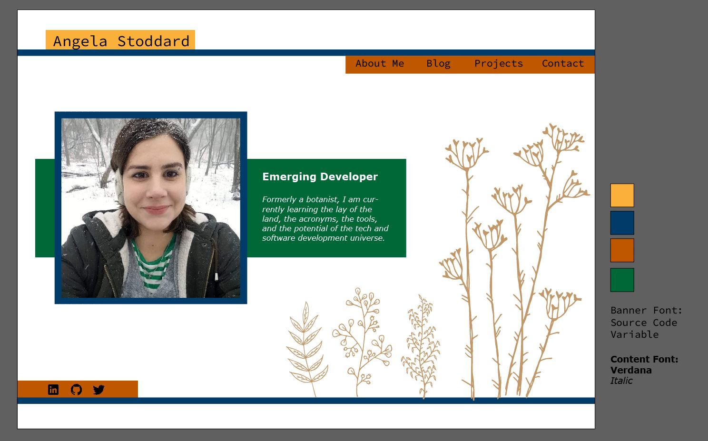

# Personal-Website
Thought I would use a repository to document my portfolio website build.

A rough design mockup, just to get started:

- Would be cool to have the botanical art shift to under the bio responsively
- Want to darken the colors, and make them slightly less opaque
- Stretch goal: add a button for darkmode